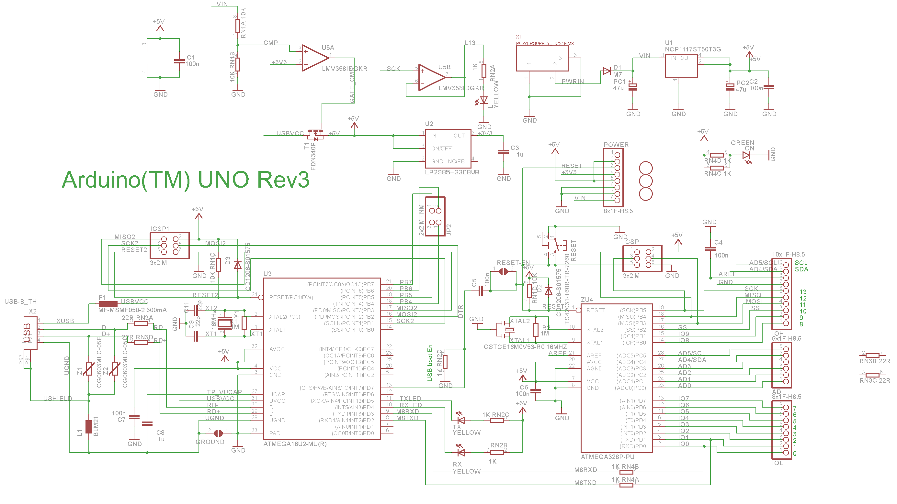
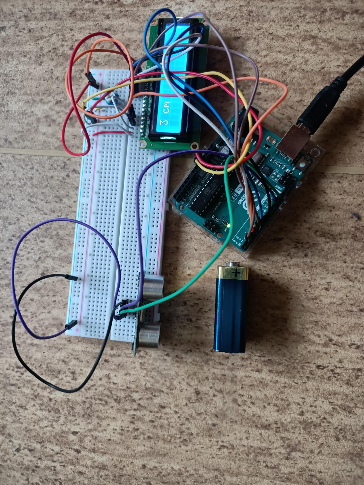
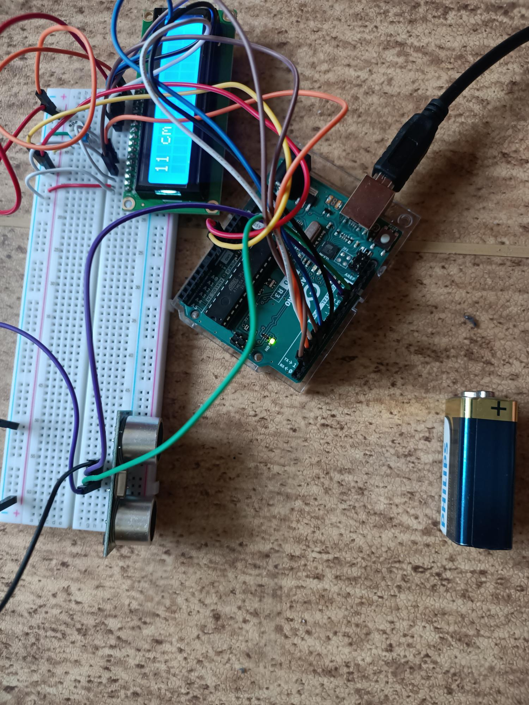

# labs-tm-project

# hardwire

# Arduino – pomiar odległości

- Przy użyciu Arduino i ultradźwiękowego czujnika HC - SR04 2-200cm możemy zrealizować pomiar odległości od obiektu przed posidanym czujnikiem, wynik wartości wyświetlany przy dołączeniu wyświetlacza LCD-03336.

# Elementy projektu

- Arduino UNO 3
- Czujnik HC-SR04 2-200cm
- Wyświetlacz LCD-03336
- Potencjometr 5kΩ
- Płytka PCB
- Przewody łączące elementy projektu
- HC - SR04 2-200cm
- LCD-03336

# Schemat płytki :



# Schematy podłączenia elementów do płytki :


# Zdjęcie połączonych elementów do płytki :




# Kod programu:

```cpp
#include <LiquidCrystal.h> //Dołączenie bilbioteki
#define trigPin 12
#define echoPin 11
LiquidCrystal lcd(2, 3, 4, 5, 6, 7); //Informacja o podłączeniu nowego wyświetlacza
void loop() {
   Serial.begin (9600);
  pinMode(trigPin, OUTPUT); //Pin, do którego podłączymy trig jako wyjście
  pinMode(echoPin, INPUT); //a echo, jako wejście
  lcd.begin(16, 2); //Deklaracja typu
  lcd.setCursor(0, 0); //Ustawienie kursora
  lcd.print(zmierzOdleglosc());
  lcd.print(" cm");
  delay(2000);
}
int zmierzOdleglosc() {
  long czas, dystans;

  digitalWrite(trigPin, LOW);
  delayMicroseconds(2);
  digitalWrite(trigPin, HIGH);
  delayMicroseconds(10);
  digitalWrite(trigPin, LOW);

  czas = pulseIn(echoPin, HIGH);
  dystans = czas / 58;

  return dystans;
}
```

# Linki

- https://www.elecrom.com/wp-content/uploads/2017/01/Arduino-Uno-R3-Schematic.png
- https://cdn.forbot.pl/blog/wp-content/uploads/2015/08/Arduino_LCD9.png
- https://cdn.forbot.pl/blog/wp-content/uploads/2015/09/Ard_9_11.png

# Film działania układu:
